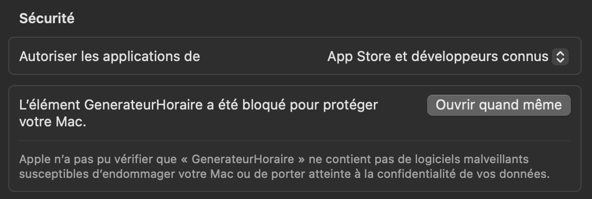

# Générateur d'Horaires

Cette application permet de générer automatiquement tous les horaires possibles à partir d'une liste de cours obligatoires et optionnels. Elle a été conçue pour gérer les horaires sur une seule semaine, alors elle ne prend pas en compte les dates de début et de fin des cours.

## Utilisation

En éxécutant le fichier, vous arrivez sur la fenêtre de création. Vous pouvez entrez des cours en y ajoutant différents groupes, un à un. Une fois un cours entré, vous pouvez appuyer sur **Sauvegarder** pour pouvoir fermer l'application et conserver vos données. Pour générer les horaires, allez au bas de la page et cliquez sur **Générer les horaires**. Ceci vous emmènera vers la fenêtre de gestion de horaires, où vous pouvez retirer progressivement des horaires pour conserver celui qui vous convient le mieux.

Pour voir le fonctionnement plus en détails, allez consulter les vidéos dans [videos](videos).

---

## Installation

### Pour **macOS**

1. Téléchargez le fichier [generateur_horaire_macOS.zip](generateur_horaire_macOS.zip) en cliquant sur le fichier puis sur **Download raw file**.

2. Décompressez le fichier zip.

3. Faites un **clic droit** sur le fichier `GenerateurHoraire.app`, puis sélectionnez **Ouvrir**. GateKeeper va empêcher d'ouvrir le fichier puisqu'il n'a pas de license. Appuyer sur **Ok**.

4. Allez dans **Réglages**, sous **Confidentialité et sécurité**. Vers le bas de la page, sous **Sécurité**, vous devriez voir le message: "L'élément GenerateurHoraire a été bloqué pour protéger votre Mac". Cliquez sur **Ouvrir quand même**.

> Une fois ouverte la première fois, vous pourrez ensuite la lancer normalement avec un double-clic.

---

### Pour **Windows**

1. Téléchargez le fichier [generateur_horaire_windows.zip](generateur_horaire_windows.zip) en cliquant sur le fichier puis sur **Download raw file**.
2. Décompressez le fichier zip.
3. Double-cliquez sur `GenerateurHoraire.exe`.
4. Si Windows affiche un avertissement de sécurité, cliquez sur **Informations supplémentaires** puis **Exécuter quand même**.

---

## Fichier de sauvegarde

Lors de son exécution, l'application crée automatiquement un dossier : `Downloads/GenerateurHoraire`.
Ce dossier contient vos cours et groupes enregistrés dans le fichier `cours.json`.
Vous pouvez supprimer ce dossier en tout temps si vous n’utilisez plus l’application, mais vous perdrez vos cours sauvegardés. 

Vous pouvez gardez plusieurs horaires en mémoire en renommant le fichier `cours.json`. Pour que l'application fonctionne correctement, vous ne devez avoir qu'un seul fichier nommer `cours.json` dans le dossier `GenerateurHoraire`. Lorsque vous voulez réutiliser un fichier de cours que vous avez renommé, remettez le dans le dossier `GenerateurHoraire` sous le nom `cours.json`.